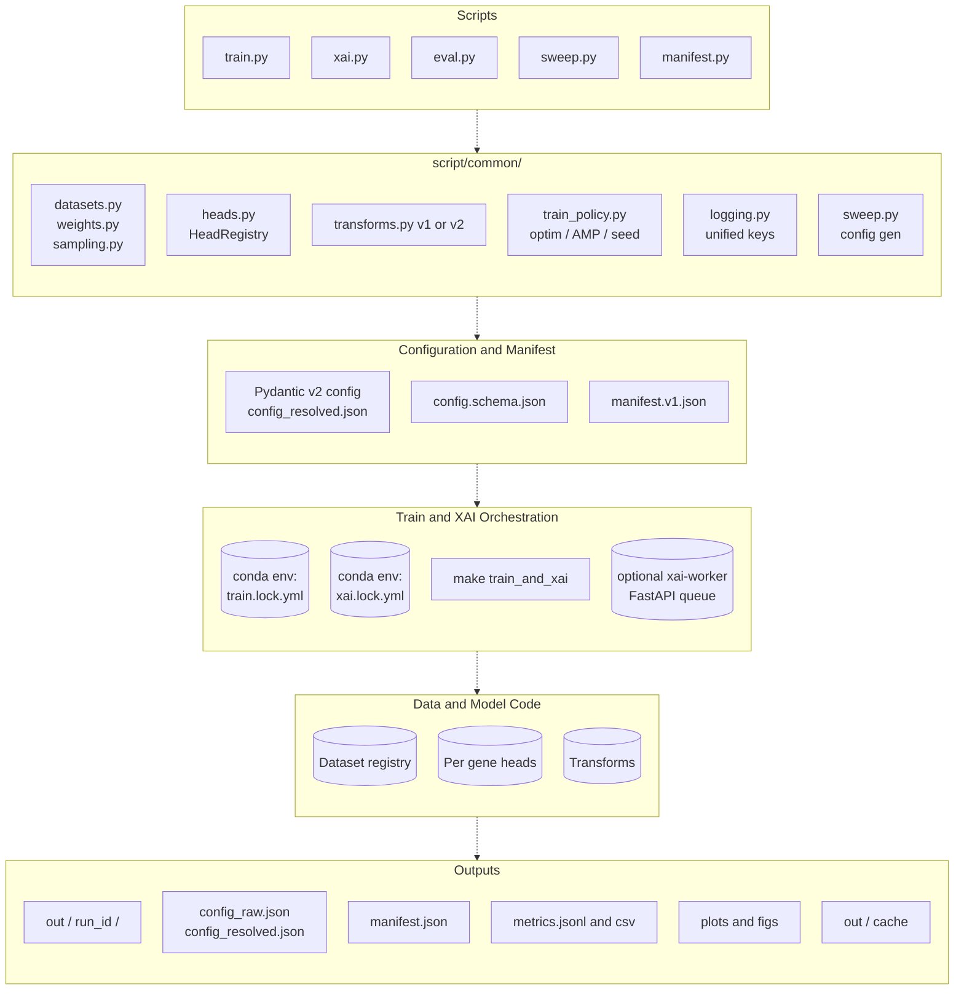
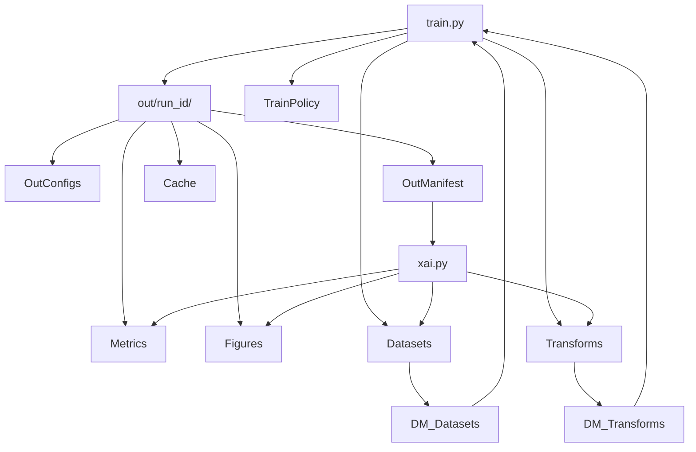

# Project Architecture Overview
This document maps the repository’s structure, major components, and data/control flow so you can quickly orient yourself and plan improvements.

## Purpose
- Supervised: Predict gene expression from histology tiles using PyTorch Lightning.
- Self‑supervised: Optional DINO pretraining for encoders on tile datasets.
- Utilities: Data transforms, label smoothing, analysis/plots, and W&B integration.

## Tech Stack
- Core: Python, PyTorch, Lightning, torchvision, timm
- SSL: lightly (DINOLoss, projection heads, transforms)
- Logging: Weights & Biases (optional)
- Env: Conda YAMLs in `conda_environments/`

## Top‑Level Layout
- `script/`: Source code
  - `main.py`: Entry for supervised training (sweep or single run)
  - `dino_main.py`: Entry for DINO self‑supervised training
  - `main_utils.py`: CLI, config parsing, sweep helpers, disk checks
  - `mem_test.py`: Parameter/memory estimation helpers
  - `get_out_path.py`: Small path helpers
  - `run_sweeps_*.py`: Launchers for W&B sweeps
- `script/train/`
  - `lit_train.py`: TrainerPipeline – end‑to‑end training orchestration (Lightning)
  - `generate_plots.py`, `generate_hists.ipynb`: Plotting, diagnostics
- `script/model/`
  - `lit_model.py`: `GeneExpressionRegressor` LightningModule (encoder + per‑gene heads)
  - `model_factory.py`: Encoder factory (ResNet, DINO, UNI2‑h), dim inference
  - `loss_functions.py`: MSE/weighted MSE/Pearson losses
  - `lit_ae.py`: Optional sparse autoencoder block
  - `lit_dino.py`: DINO LightningModule (student/teacher, EMA, heads)
  - `generate_results.py`, `restructure.py`: Result utilities/migrations
- `script/data_processing/`
  - `lit_STDataModule.py`: LightningDataModule (build train/val/test datasets + loaders)
  - `data_loader.py`: Dataset assembly from CSVs (tiles + gene values), weighting, bins
  - `image_transforms.py`: Torchvision transforms (v1/v2 support)
  - `process_csv.py`: CSV generation/merging helpers; DINO CSV split
  - `lds.py`, `lds_helpers.py`, `fds.py`, `fds_utils.py`: Label distribution smoothing utilities
  - `patching.py`, `custom_transforms.py`: Misc helpers
- `script/evaluation/`: Notebooks and scripts for clustering, hists, plots, CRP
- `script/dino/`: Lightly example baseline
- `sweeps/`: Sweep configs and launch scripts (YAML‑like files without extension)
- `conda_environments/`: Environment specs
- `dino.md`, `todo.md`: Notes and backlogs

## Configuration & Sweeps
- Configs are YAML‑like (often extensionless) files, e.g. `sweeps/configs/debug`.
- `main_utils.py` parses and flattens parameter values into a run config.
- Dataset defaults and sample splits are injected from `script/configs/dataset_config.py`.
- Gene list detection: if not provided, `script/main.py` infers genes by intersecting numeric columns across sample CSVs (`gene_data_filename`). Optional chunking via `split_genes_by`.
- Sweeps: `main.py` auto‑builds a W&B sweep by lifting parameters from the config and injecting gene chunks as sweep values.

## Supervised Pipeline (GeneExpressionRegressor)
Flow (driven by `TrainerPipeline` in `script/train/lit_train.py`):
1) Config: Parse YAML, inject dataset defaults, infer/validate gene list
2) Data: `lit_STDataModule` builds `STDataset` with transforms, optional LDS weighting and binning
3) Model: `lit_model.GeneExpressionRegressor`
   - Encoder from `model_factory.get_encoder(encoder_type)`
   - Optional SAE block (`lit_ae.SparseAutoencoder`)
   - Per‑gene heads (1× or 2× FC layers) assembled as attributes
   - Loss: MSE, Weighted MSE (with LDS weights), or Pearson
4) Optim/Schd: AdamW with param groups (encoder + per‑gene heads) and `OneCycleLR`
5) Precision/Device: CUDA/MPS/CPU detection; mixed precision chosen dynamically
   - CUDA with bf16 support → `precision="bf16-mixed"`
   - Other CUDA → `precision=16` (fp16 mixed)
   - Non‑GPU → `precision=32`
6) Tuning: Optional LR finder (`Tuner.lr_find`) per component; freeze‑encoder supported
7) Training: Lightning `Trainer.fit`; metrics/logs to W&B (optional)
8) Validation: Per‑gene Pearson r, dataset‑level metrics; best/last checkpoints persisted
9) Optional spatial prediction/plots: Per‑tile predictions → scatter/triptych plots and parquet export

Outputs (under `out_path`):
- `config.json`, `latest.pth`, `best_model.pth`, `split_manifest.csv`, parquet spatial results, plots
- If W&B enabled: run artifacts with model + config

## Self‑Supervised (DINO)
- Entry: `script/dino_main.py`
- Model: `script/model/lit_dino.py` (student/teacher backbones + projection heads, EMA via `update_momentum`)
- Loss: `lightly.loss.DINOLoss`
- Data: `process_csv.get_dino_csv()` builds `(train.csv, val.csv)` from folder trees; transforms from `lightly.transforms.DINOTransform`
- Trainer: Lightning `Trainer` with dynamic precision (bf16‑mixed on supported GPUs)
- Scheduler: `OneCycleLR`; LR is tuned or fixed depending on debug mode

## Data Processing Details
- `STDataset`: wraps tile image and gene targets; optional LDS weight columns `f"{gene}_lds_w"`
- `get_base_dataset`: merges per‑sample CSVs, attaches absolute tile paths and patient IDs; applies LDS weighting and optional bin oversampling
- `image_transforms.get_transforms`: Torchvision v2 or v1 transforms (resize, crop, flip, rotate, dtype/normalize)

## Key Extension Points
- New encoder: add in `model_factory.get_encoder` and ensure `infer_encoder_out_dim` works
- New loss: add in `loss_functions.py` and wire through `lit_model` via `loss_fn_switch`
- New metrics: extend `lit_model` validation to compute/log more metrics
- Custom transforms: add to `image_transforms.py` and thread through DataModule
- Spatial outputs: adjust parquet schema/plots in `lit_train.py`

## Common Commands
- Supervised single run: `python script/main.py --config sweeps/configs/debug`
- Sweep: same command with a config that defines parameter `values`; sweep orchestration happens in `main.py`
- DINO: `python script/dino_main.py --config sweeps/configs/dino`

## Observations & Improvement Ideas
- Config typing: Introduce dataclasses/Pydantic for config validation and defaults
- Head modules: Replace dynamically added attributes with `nn.ModuleDict` for clarity
- Transforms: Unify v1/v2 branches; avoid double‑normalize; expose normalization flag consistently
- Datasets: Factor large `data_loader.py` into smaller files (datasets, weighting, plotting)
- Metrics: Log standardized metrics across losses; add MAE and per‑patient summaries
- Precision: Centralize mixed precision policy across all entry points (now partially done)
- Testing: Add unit tests for data assembly, loss/metric computation, and config parsing
- CI: Lightweight lint/format checks and a small synthetic data smoke test

## Quick Map of Important Files
- Supervised: `script/main.py`, `script/train/lit_train.py`, `script/model/lit_model.py`
- Data: `script/data_processing/lit_STDataModule.py`, `script/data_processing/data_loader.py`
- DINO: `script/dino_main.py`, `script/model/lit_dino.py`
- Encoders: `script/model/model_factory.py`
- Losses: `script/model/loss_functions.py`
- Config/Datasets: `script/configs/dataset_config.py`, `script/main_utils.py`
- Docs/Notes: `dino.md`, `todo.md`

