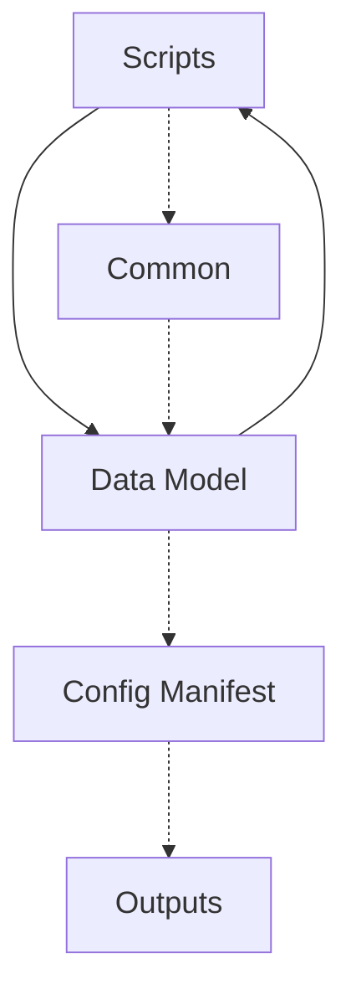
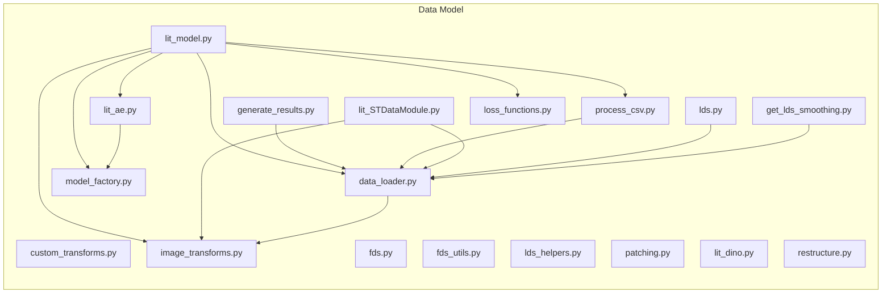

# Project Architecture — Auto-Generated

## Overview (modules)

```mermaid
%%{init:{
  "securityLevel":"loose",
  "flowchart":{"htmlLabels":true,"nodeSpacing":36,"rankSpacing":72,"useMaxWidth":true},
  "themeVariables":{"fontSize":"19px"}
}}%%
flowchart TB

Scripts["Scripts"];
Common["Common"];
Data_Model["Data Model"];
Config_Manifest["Config Manifest"];
Outputs["Outputs"];

Data_Model --> Scripts;
Scripts --> Data_Model;

Scripts -.-> Common;
Common -.-> Data_Model;
Data_Model -.-> Config_Manifest;
Config_Manifest -.-> Outputs;
```

## Scripts (files)

```mermaid
%%{init:{
  "securityLevel":"loose",
  "flowchart":{"htmlLabels":true,"nodeSpacing":44,"rankSpacing":84,"useMaxWidth":true},
  "themeVariables":{"fontSize":"22px"}
}}%%
flowchart TB
subgraph Scripts [Scripts]
  direction TB
  script_cluster_py[cluster.py];
  script_configs_config_factory_py[config_factory.py];
  script_configs_dataset_config_py[dataset_config.py];
  script_configs_dino_config_py[dino_config.py];
  script_dino_dino_original_lightly_py[dino_original_lightly.py];
  script_dino_main_py[dino_main.py];
  script_evaluation_cluster_explanations_py[cluster_explanations.py];
  script_evaluation_cluster_functions_py[cluster_functions.py];
  script_evaluation_crp_plotting_py[crp_plotting.py];
  script_evaluation_display_hists_py[display_hists.py];
  script_evaluation_generate_data_hists_py[generate_data_hists.py];
  script_evaluation_lit_clustering_py[lit_clustering.py];
  script_evaluation_plot_and_print_py[plot_and_print.py];
  script_evaluation_plot_training_py[plot_training.py];
  script_evaluation_relevance_py[relevance.py];
  script_evaluation_umap_with_images_py[umap_with_images.py];
  script_generate_data_hists_py[generate_data_hists.py];
  script_get_out_path_py[get_out_path.py];
  script_main_py[main.py];
  script_main_utils_py[main_utils.py];
  script_manifest_py[manifest.py];
  script_mem_test_py[mem_test.py];
  script_run_data_hist_wandb_pipeline_py[run_data_hist_wandb_pipeline.py];
  script_run_sweeps_base_training_py[run_sweeps_base_training.py];
  script_run_sweeps_dino_training_py[run_sweeps_dino_training.py];
  script_sweep_py[sweep.py];
  script_train_generate_plots_py[generate_plots.py];
  script_train_lit_train_py[lit_train.py];
  script_unimodel_py[unimodel.py];
  script_utils_utils__py[utils_.py];
end

script_cluster_py --> script_evaluation_cluster_functions_py;
script_evaluation_lit_clustering_py --> script_configs_config_factory_py;
script_evaluation_lit_clustering_py --> script_evaluation_cluster_functions_py;
script_evaluation_lit_clustering_py --> script_main_utils_py;
script_main_py --> script_configs_dataset_config_py;
script_main_py --> script_train_lit_train_py;
script_mem_test_py --> script_configs_dataset_config_py;
script_run_data_hist_wandb_pipeline_py --> script_configs_dataset_config_py;
script_run_sweeps_dino_training_py --> script_configs_dino_config_py;
classDef big fill:#fff,stroke:#999,stroke-width:1px,font-size:24px;
class script_cluster_py,script_configs_config_factory_py,script_configs_dataset_config_py,script_configs_dino_config_py,script_dino_dino_original_lightly_py,script_dino_main_py,script_evaluation_cluster_explanations_py,script_evaluation_cluster_functions_py,script_evaluation_crp_plotting_py,script_evaluation_display_hists_py,script_evaluation_generate_data_hists_py,script_evaluation_lit_clustering_py,script_evaluation_plot_and_print_py,script_evaluation_plot_training_py,script_evaluation_relevance_py,script_evaluation_umap_with_images_py,script_generate_data_hists_py,script_get_out_path_py,script_main_py,script_main_utils_py,script_manifest_py,script_mem_test_py,script_run_data_hist_wandb_pipeline_py,script_run_sweeps_base_training_py,script_run_sweeps_dino_training_py,script_sweep_py,script_train_generate_plots_py,script_train_lit_train_py,script_unimodel_py,script_utils_utils__py big;
```

## Common (files)

```mermaid
%%{init:{
  "securityLevel":"loose",
  "flowchart":{"htmlLabels":true,"nodeSpacing":36,"rankSpacing":72,"useMaxWidth":true},
  "themeVariables":{"fontSize":"19px"}
}}%%
flowchart TB
subgraph Common [Common]
  direction TB
end
```

## Data Model (files)

```mermaid
%%{init:{
  "securityLevel":"loose",
  "flowchart":{"htmlLabels":true,"nodeSpacing":36,"rankSpacing":72,"useMaxWidth":true},
  "themeVariables":{"fontSize":"19px"}
}}%%
flowchart TB
subgraph Data_Model [Data Model]
  direction TB
  script_data_processing_custom_transforms_py[custom_transforms.py];
  script_data_processing_data_loader_py[data_loader.py];
  script_data_processing_fds_py[fds.py];
  script_data_processing_fds_utils_py[fds_utils.py];
  script_data_processing_get_lds_smoothing_py[get_lds_smoothing.py];
  script_data_processing_image_transforms_py[image_transforms.py];
  script_data_processing_lds_helpers_py[lds_helpers.py];
  script_data_processing_lds_py[lds.py];
  script_data_processing_lit_STDataModule_py[lit_STDataModule.py];
  script_data_processing_patching_py[patching.py];
  script_data_processing_process_csv_py[process_csv.py];
  script_model_generate_results_py[generate_results.py];
  script_model_lit_ae_py[lit_ae.py];
  script_model_lit_dino_py[lit_dino.py];
  script_model_lit_model_py[lit_model.py];
  script_model_loss_functions_py[loss_functions.py];
  script_model_model_factory_py[model_factory.py];
  script_model_restructure_py[restructure.py];
end

script_data_processing_data_loader_py --> script_data_processing_image_transforms_py;
script_data_processing_get_lds_smoothing_py --> script_data_processing_data_loader_py;
script_data_processing_lds_py --> script_data_processing_data_loader_py;
script_data_processing_lit_STDataModule_py --> script_data_processing_data_loader_py;
script_data_processing_lit_STDataModule_py --> script_data_processing_image_transforms_py;
script_data_processing_process_csv_py --> script_data_processing_data_loader_py;
script_model_generate_results_py --> script_data_processing_data_loader_py;
script_model_lit_ae_py --> script_model_model_factory_py;
script_model_lit_model_py --> script_data_processing_data_loader_py;
script_model_lit_model_py --> script_data_processing_image_transforms_py;
script_model_lit_model_py --> script_data_processing_process_csv_py;
script_model_lit_model_py --> script_model_lit_ae_py;
script_model_lit_model_py --> script_model_loss_functions_py;
script_model_lit_model_py --> script_model_model_factory_py;
```

## Config Manifest (files)

```mermaid
%%{init:{
  "securityLevel":"loose",
  "flowchart":{"htmlLabels":true,"nodeSpacing":36,"rankSpacing":72,"useMaxWidth":true},
  "themeVariables":{"fontSize":"19px"}
}}%%
flowchart TB
subgraph Config_Manifest [Config Manifest]
  direction TB
end
```

## Outputs (files)

```mermaid
%%{init:{
  "securityLevel":"loose",
  "flowchart":{"htmlLabels":true,"nodeSpacing":36,"rankSpacing":72,"useMaxWidth":true},
  "themeVariables":{"fontSize":"19px"}
}}%%
flowchart TB
subgraph Outputs [Outputs]
  direction TB
end
```
